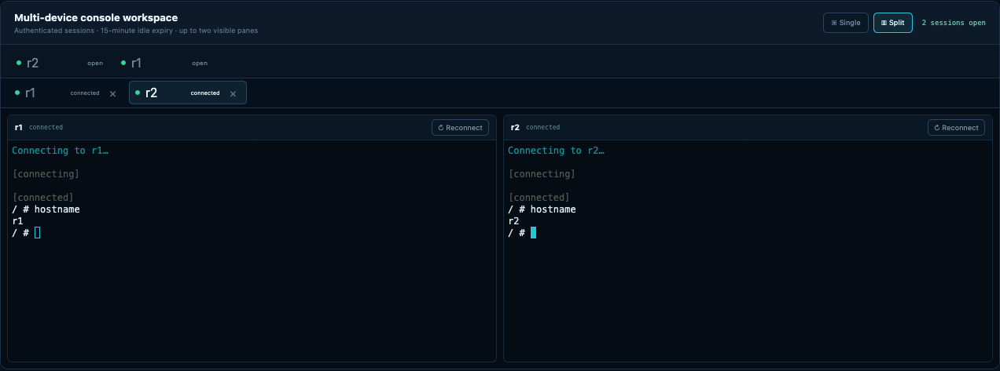
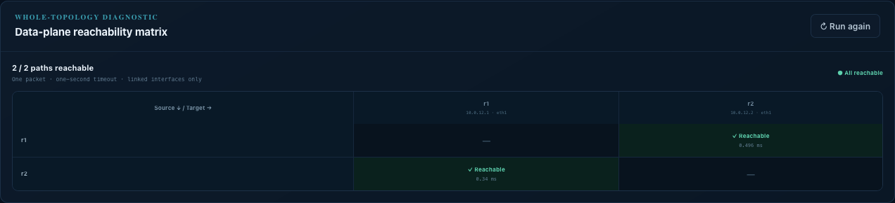
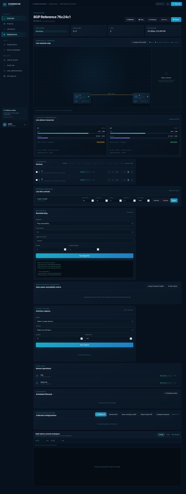

# ContainerLab Studio

**A visual, self-hosted network lab platform for Kubernetes.** Design topologies, choose exact device interfaces, manage images, launch labs, open browser consoles, troubleshoot links, and preserve configuration evidence without asking operators to write Containerlab YAML or Kubernetes manifests.

[](https://github.com/mohanDontineni/containerlab_ui/actions/workflows/container-image.yml) [](LICENSE)


## What you can do

- Create isolated projects, members, quotas, folders, labs, and immutable revisions.
- Upload a licensed OCI/Docker archive or register an existing registry image through guided forms.
- Build topologies visually with template-aware interfaces, startup configuration, notes, regions, duplication, arrangement, validation, and deployment preview.
- Start, stop, restart, suspend, resume, reset, and stage individual devices or whole labs.
- Open authenticated multi-device browser consoles and inspect logs, events, interfaces, routes, neighbors, traffic, CPU, and memory.
- Apply and save link latency, jitter, loss, corruption, rate, or shutdown profiles.
- Run bounded ping, traceroute, reachability matrices, packet captures, configuration collection, drift comparison, and evidence exports.
- Track asynchronous operations and security-sensitive actions through native job and audit views.

## One-command Kubernetes install

Prerequisites: an `amd64` Kubernetes cluster, `kubectl`, Helm 3, OpenSSL, a default StorageClass, and access to GHCR. The selected `kubectl` context is the installation target.

```bash
git clone https://github.com/mohanDontineni/containerlab_ui.git
cd containerlab_ui
./studioctl install
```

The command creates the `containerlab` namespace, installs pinned Clabernetes when absent, generates application/database secrets and a one-year self-signed certificate, installs Studio with readiness waits, and runs live smoke checks. It never replaces existing secrets.

Open the URL printed at completion and retrieve the generated first-login credential:

```bash
./studioctl credentials
```

The bootstrap administrator must change the password after sign-in. Delete the `containerlab-studio-initial-admin` Secret after rotation. A production example with an existing certificate, trusted hostname, storage class, and immutable image is documented in [the lifecycle guide](docs/installation-lifecycle.md). Common overrides look like this:

```bash
KUBE_CONTEXT=my-cluster STUDIO_HOST=studio.example.com \
STORAGE_CLASS=fast-rwo IMAGE_TAG=sha-0123456 ./studioctl install
```

`main` is the convenient rolling image. Production installations should pin a published `v*` or `sha-*` tag. Run `./studioctl verify` at any time.

## Product tour

### Projects and reusable labs


The dashboard combines platform health, capacity, recent failures, projects, labs, deployments, devices, and images. Projects enforce role-based access and quotas; nested folders keep larger libraries navigable.

### Network images


Upload resumable OCI/Docker archives only when you have usage rights, or register an existing OCI reference. Studio validates architecture and metadata, preserves checksums and supply-chain evidence, and publishes verified content internally. **No proprietary network operating-system images are included.**

### Visual topology—no YAML


Drag a versioned template onto the canvas, select a compatible image, enter startup configuration, and connect explicit unused interfaces. The server repeats client validation before publishing or deploying.

### Live operations and consoles


The runtime map shows desired and observed state. Guarded, idempotent jobs drive device and whole-lab controls without exposing Kubernetes or launcher shells.



Open several expiring device sessions in one authenticated console workspace and switch between one- and two-pane layouts.

### Reachability and link behavior



The matrix discovers linked addresses and runs bounded probes between ready devices. Traffic evidence, diagnostics, packet analysis, and health exports stay in the UI.



Set latency, jitter, loss, corruption, rate, or shutdown state live; save verified conditions to a draft; and replay them on later deployments.

The complete walkthrough contains **94 real Firefox captures** in [training/GALLERY.md](training/GALLERY.md), with an operation index in [training/README.md](training/README.md).

## Architecture and production operations

Studio uses Django/DRF/Channels, React and React Flow, PostgreSQL, Redis/Celery, an internal OCI Distribution registry, and Clabernetes. A restricted reconciler converts validated product intent into isolated runtime namespaces. The GUI and authenticated API are the normal operator boundary; generated YAML is internal.

Read [architecture](docs/architecture.md), [runtime compatibility](docs/runtime-compatibility.md), [security](docs/security.md), [backup and restore](docs/backup-restore.md), and the honest [implementation status](IMPLEMENTATION_STATUS.md). VM-backed nodes need KVM-capable workers. Image licensing, hardware support, and vendor redistribution terms remain the deployer's responsibility.

## Development

```bash
python3 -m venv .venv
.venv/bin/pip install -r requirements-dev.txt
.venv/bin/pytest -q
pnpm --dir frontend install --frozen-lockfile
pnpm --dir frontend test
pnpm --dir frontend build
```

The non-root production image is built from pinned Python, Node, and pnpm inputs. Pull requests run tests and an OCI build. Main and version tags publish SBOM- and provenance-enabled images to GHCR.

## Open source

ContainerLab Studio is licensed under [Apache License 2.0](LICENSE). Contributions are welcome; read [CONTRIBUTING.md](CONTRIBUTING.md), [SECURITY.md](SECURITY.md), and [CODE_OF_CONDUCT.md](CODE_OF_CONDUCT.md).

Containerlab, Clabernetes, Kubernetes, vendor names, and product marks belong to their owners. This project is not affiliated with or endorsed by EVE-NG or network operating-system vendors.
