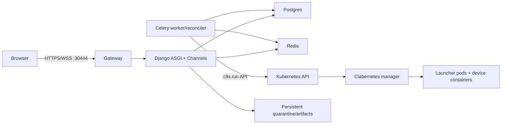

# Architecture

Saved `LabRevision` state is immutable and separate from `LabDeployment` desired/observed state. Uploads become quarantined `ImageArtifact` records; only a successful approved build and immutable digest creates a `PublishedImage`.

Example 1: a duplicate deploy click reuses its idempotency record and the database prevents another active operation. Example 2: pod Running does not set device readiness; reconciliation consumes Clabernetes Node/Topology readiness separately.

